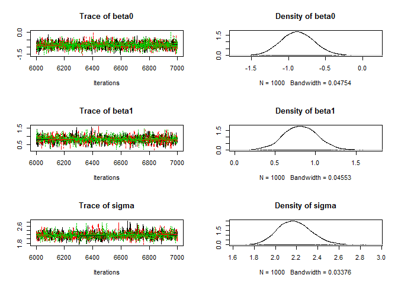

Exercise I: Fitting a linear model using maximum likelihood and Gibbs sampling
==============================================================================

Richard Chandler Warnell School of Forestry and Natural Resources University of Georgia <rchandler@warnell.uga.edu>

The model
=========

Simple linear regression is one of the most basic statistical models. There are several ways to describe the model. Here is one option:
*y*<sub>*i*</sub> ∼ *N**o**r**m*(*μ*<sub>*i*</sub>, *σ*<sup>2</sup>)  *f**o**r* *i* = 1, …, *n*
 where *μ*<sub>*i*</sub> = *β*<sub>0</sub> + *β*<sub>1</sub>*x*<sub>*i*</sub> and *x*<sub>*i*</sub> is a continuous covariate.

Here's another:
*y*<sub>*i*</sub> = *β*<sub>0</sub> + *β*<sub>1</sub>*x*<sub>*i*</sub> + *ε*<sub>*i*</sub>
 where *ε*<sub>*i*</sub> ∼ *N**o**r**m*(0, *σ*<sup>2</sup>).

A third option is to use matrix notation:
$${\\bf y} = {\\bf X}{\\boldsymbol \\beta} + {\\boldsymbol \\varepsilon}$$
 where ${\\bf y}$ is the response vector and $\\bf X$ is the design matrix, a *n* × *p* matrix with the the first column being a vector of 1's corresponding to the intercept and the other columns containing the covariates, which will be dummy variables for factors. In simple linear regression, there is only one covariate, so *p* = 2. The vector of coefficients to be estimated is denoted by $\\boldsymbol \\beta$, and $\\boldsymbol \\varepsilon$ is the vector of residuals.

Inference
=========

A linear regression can be fitted to the data using ordinary least squares (OLS), which is fast and convienient, but not generalizable to non-Gaussian problems. We will focus instead on maximum likelihood and MCMC for performing classical and Bayesian inference, respectively.

Classical, likelihood-based approach
------------------------------------

The likelihood is the joint probability density of the data viewed as a function of the parameters. In this case, the probability density for a single observation is *p*(*y*<sub>*i*</sub>|*β*<sub>0</sub>, *β*<sub>1</sub>, *σ*)=*N**o**r**m*(*μ*<sub>*i*</sub>, *σ*<sup>2</sup>), and under the standard independence assumption, the joint density is the product of the *n* densities:
$$L(\\beta\_0,\\beta\_1,\\sigma|{\\bf y}) = \\prod\_{i=1}^n
p(y\_i|\\beta\_0,\\beta\_1,\\sigma)$$

In practice, the likelihood is evaluated on the log scale to avoid computational problems that can result from multiplying small probabilities. The log-likelihood is just this:
$$l(\\beta\_0,\\beta\_1,\\sigma|y\_i) = \\sum\_{i=1}^n
\\log(p(y\_i|\\beta\_0,\\beta\_1,\\sigma))$$

In `R`, most of the optimizers want the negative log-likelihood, which we can write like this:

``` r
lm.like <- function(pars,y,x) {
    beta0 <- pars[1]
    beta1 <- pars[2]
    sigma <- pars[3]
    mu <- beta0 + beta1*x
    return(-sum(dnorm(y, mu, sigma, log=TRUE)))
}
```

Plugging in values for the parameters will return the negative log-likelihood for a particular dataset. The goal of classical inference is to find the parameters that maximize the likelihood. It's easiest to let computers do the work, and `R` has many functions for the task, including `optim` and `nlm`.

Bayesian approach
-----------------

Bayesian inference is also based on the likelihood, but the goal is to characterize the posterior distribution of the parameters, given the data and a user specified prior distribution. The posterior distribution describes our uncertainty about the parameters.

The posterior distribution of the linear model parameters is:
$$
p(\\beta\_0,\\beta\_1,\\sigma|{\\bf y}) \\propto \\left\\lbrace \\prod\_{i=1}^n
p(y\_i|\\beta\_0,\\beta\_1,\\sigma)\\right\\rbrace p(\\beta\_0,\\beta\_1,\\sigma)
$$
 where the first term on the right-hand side of the equation should look familiar because it is the likelihood discussed above. The second term is the prior distribution of the parameters.

Normally, the prior distributions are taken to be independent of one another, and if little prior information is available, diffuse Gaussian or uniform distributions are often used to characterize the lack of knowledge. The prior distributions will have little effect on the posterior distribution if data are informative about the parameters of interest. However, it's always important to assess the influence of the prior.

The computational challenge facing Bayesians is that it is rarely possible to compute the posterior distribution directly because it is a multivarite distribution with an intractible normalizing constant. This seemly enormous problem can be resolved using Markov chain Monte Carlo methods. Gibbs sampling is the most general MCMC technique, and it involves sequentially sampling each parameter from its full conditional distribution -- the probability distribution of the parameter of interest, conditional on the data and all the other paramters in the model. For a linear model, a Gibbs sampler would involve repeating the following steps several thousand times:

------------------------------------------------------------------------

#### Step 1: Sample *β*<sub>0</sub> from its full conditional distribution:

$$
p(\\beta\_0|\\beta\_1,\\sigma) \\propto \\left\\lbrace \\prod\_{i=1}^n
p(y\_i|\\beta\_0,\\beta\_1,\\sigma) \\right\\rbrace p(\\beta\_0)
$$

#### Step 2: Sample *β*<sub>1</sub> from its full conditional distribution:

$$p
(\\beta\_1|\\beta\_0,\\sigma) \\propto \\left\\lbrace \\prod\_{i=1}^n
p(y\_i|\\beta\_0,\\beta\_1,\\sigma)\\right\\rbrace p(\\beta\_1)
$$

#### Step 3: Sample *σ* from its full conditional distribution:

$$
p(\\sigma|\\beta\_0,\\beta\_1) \\propto \\left\\lbrace \\prod\_{i=1}^n
p(y\_i|\\beta\_0,\\beta\_1,\\sigma)\\right\\rbrace p(\\sigma)
$$

------------------------------------------------------------------------

So, what do the full conditional distributions looks like? In this case, if conjugate prior distributions are used, the full conditional distributions are Gaussian for the *β*'s and gamma for *σ*. A great cheat sheet can be found [here](https://en.wikipedia.org/wiki/Conjugate_prior#Table_of_conjugate_distributions). However, we often don't want to restrict ourselves to conjugate priors, in which case we can use a Metropolis-Hastings algorithm to indirectly sample from each full conditional distribution. For example, we can propose *β*<sub>0</sub><sup>\*</sup> ∼ *N**o**r**m*(*β*<sub>0</sub>, *t**u**n**e*<sub>1</sub>) and accept this candidate value with probability min(1, *R*) where *R* is the MH acceptance ratio:

$$
  R = \\frac{\\left\\lbrace \\prod\_{i=1}^{n} p(y\_i|\\beta\_{0}^{\\star},\\beta\_1,\\sigma^2)\\right\\rbrace p(\\beta\_0^{\*})p(\\beta\_0|\\beta\_0^{\*})}{\\left\\lbrace \\prod\_{i=1}^n
  p(y\_i|\\beta\_0,\\beta\_1,\\sigma^2)\\right\\rbrace p(\\beta\_0)p(\\beta\_{0}^{\*}|\\beta\_0)}
$$

Notice that the numerator and the denominator are made up of the product of the likelihood, the prior, and the proposal distributions. The likelihood and prior in the numerator are associated with the the candidate value. The proposal distribution in the numerator is the probability density associated with transitioning from *β*<sub>0</sub><sup>\*</sup> back to *β*<sub>0</sub>. The denominator has the likelihood and prior of the current values, along with the probability density associated with moving to the candidate from the current value of *β*<sub>0</sub>. If a symmetric proposal distribution is used, the thrid terms in the numerator and denominator cancel out and do not need to be computed.

Example
=======

Here we demonstrate how to fit a simple linear model using both classical and Bayesian methods.

Simulate a dataset
------------------

Here's some **R** code to simulate *x* and *y*:

``` r
set.seed(348720) # To make this reproducible
n <- 100
x <- rnorm(n) # Covariate
beta0 <- -1
beta1 <- 1
sigma <- 2

mu <- beta0 + beta1*x     # expected value of y
y <- rnorm(n, mu, sigma)  # realized values (ie, the response variable)
```

Take a look:

``` r
cbind(x,y)[1:4,] # First 4 observations
```

    ##                x          y
    ## [1,] -0.93295514 -0.2223842
    ## [2,] -0.02648071 -3.7537644
    ## [3,] -0.23166802 -0.7151488
    ## [4,]  1.64687862 -0.6357651

``` r
plot(x,y)
```


Classical analysis
------------------

Here is an R function to compute the negative log-likelihood:

``` r
nll <- function(pars) {
    beta0 <- pars[1]
    beta1 <- pars[2]
    sigma <- pars[3]
    mu <- beta0 + beta1*x
    ll <- dnorm(y, mean=mu, sd=sigma, log=TRUE)
    -sum(ll)
}
```

### Minimize the negative log-likelihood

Now that we have data and a likelihood function, we need to find the parameter values that maximize the log-likelihood, or equivalently, minimize the negative log-likelihood. Before we do that, note that we could try the brute force approach of guessing parameter values, evaluating the likelihood, and then repeating until we can't lower the negative log-likelihood anymore. For example:

``` r
# Guess the parameter values and evalueate the likelihood
starts <- c(beta0=0,beta1=0,sigma=1)
nll(starts)
```

    ## [1] 397.9182

``` r
## Another guess. This one is better because nll is lower
starts2 <- c(beta0=-1,beta1=0,sigma=1)
nll(starts2)
```

    ## [1] 352.6342

This is obviously a bad idea. Even with only three parameters, it would take forever to find the true maximum likelihood estimates (MLEs). Fortunately, there are many optimization functions in `R`. We'll use `optim`, but `nlm` or `nlminb` would work just as well.

The `optim` function requires starting values and a likelihood function. If the likelihood function needs arguments other than the parameter vector, you can pass these to optim through the `...` argument. If you want standard errors, you need to compute the hessian matrix.

``` r
fm <- optim(starts, nll, hessian=TRUE)
fm
```

    ## $par
    ##      beta0      beta1      sigma 
    ## -0.8780081  0.8198882  2.1215936 
    ## 
    ## $value
    ## [1] 217.1089
    ## 
    ## $counts
    ## function gradient 
    ##       98       NA 
    ## 
    ## $convergence
    ## [1] 0
    ## 
    ## $message
    ## NULL
    ## 
    ## $hessian
    ##               beta0         beta1        sigma
    ## beta0 22.2164990404 -2.0284602584 5.715464e-04
    ## beta1 -2.0284602584 23.7002731112 8.536745e-04
    ## sigma  0.0005715464  0.0008536745 4.443078e+01

The `par` component has the MLEs. The `value` component is the negative log-likelihood at the MLEs. The `convergence` value should be 0. To obtain the SEs, we need to first invert the Hessian to get the variance-covariance matrix:

``` r
vcov <- solve(fm$hessian)
SEs <- sqrt(diag(vcov))
```

Now, let's compare our results:

``` r
mles <- fm$par # The maximum likelihood estimates
cbind(Est=mles, SE=SEs)
```

    ##              Est        SE
    ## beta0 -0.8780081 0.2129932
    ## beta1  0.8198882 0.2062182
    ## sigma  2.1215936 0.1500231

to results from `lm`:

``` r
summary(lm(y~x))
```

    ## 
    ## Call:
    ## lm(formula = y ~ x)
    ## 
    ## Residuals:
    ##     Min      1Q  Median      3Q     Max 
    ## -5.2770 -1.4190 -0.1121  1.3182  4.3638 
    ## 
    ## Coefficients:
    ##             Estimate Std. Error t value Pr(>|t|)    
    ## (Intercept)  -0.8780     0.2152  -4.081 9.16e-05 ***
    ## x             0.8199     0.2083   3.936 0.000155 ***
    ## ---
    ## Signif. codes:  0 '***' 0.001 '**' 0.01 '*' 0.05 '.' 0.1 ' ' 1
    ## 
    ## Residual standard error: 2.143 on 98 degrees of freedom
    ## Multiple R-squared:  0.1365, Adjusted R-squared:  0.1277 
    ## F-statistic: 15.49 on 1 and 98 DF,  p-value: 0.0001549

The results are very similar. The small differences are likely due to the use of maximum likelihood instead of ordinary least-squares, which is used by `lm`.

### Bayesian analysis

#### A Gibbs sampler in `R`

``` r
lm.gibbs <- function(y, x, niter=10000, start, tune) {
samples <- matrix(NA, niter, 3)
colnames(samples) <- c("beta0", "beta1", "sigma")
beta0 <- start[1]; beta1 <- start[2]; sigma <- start[3]

for(iter in 1:niter) {
    ## Sample from p(beta0|dot)
    mu <- beta0 + beta1*x
    ll.y <- sum(dnorm(y, mu, sigma, log=TRUE))
    prior.beta0 <- dnorm(beta0, 0, 1000, log=TRUE)
    beta0.cand <- rnorm(1, beta0, tune[1])
    mu.cand <- beta0.cand + beta1*x
    ll.y.cand <- sum(dnorm(y, mu.cand, sigma, log=TRUE))
    prior.beta0.cand <- dnorm(beta0.cand, 0, 1000, log=TRUE)
    R <- exp((ll.y.cand+prior.beta0.cand) - (ll.y+prior.beta0)) #MHR
    if(runif(1) < R) {
        beta0 <- beta0.cand
    }

    ## Sample from p(beta1|dot)
    mu <- beta0 + beta1*x
    ll.y <- sum(dnorm(y, mu, sigma, log=TRUE))
    prior.beta1 <- dnorm(beta1, 0, 1000, log=TRUE)
    beta1.cand <- rnorm(1, beta1, tune[2])
    mu.cand <- beta0 + beta1.cand*x
    ll.y.cand <- sum(dnorm(y, mu.cand, sigma, log=TRUE))
    prior.beta1.cand <- dnorm(beta1.cand, 0, 1000, log=TRUE)
    R <- exp((ll.y.cand+prior.beta1.cand) - (ll.y+prior.beta1))
    if(runif(1) < R) {
        beta1 <- beta1.cand
    }

    ## Sample from p(sigma|dot)
    ll.y <- sum(dnorm(y, mu, sigma, log=TRUE))
    prior.sigma <- dunif(sigma, 0, 1000, log=TRUE)
    sigma.cand <- rlnorm(1, log(sigma), tune[3])
    mu <- beta0 + beta1*x
    ll.y <- sum(dnorm(y, mu, sigma, log=TRUE))
    prior.sigma <- dunif(sigma, 0, 1000, log=TRUE)
    prop.sigma <- dlnorm(sigma, log(sigma.cand), tune[3], log=TRUE)
    ll.y.cand <- sum(dnorm(y, mu, sigma.cand, log=TRUE))
    prior.sigma.cand <- dunif(sigma.cand, 0, 1000, log=TRUE)
    prop.sigma.cand <- dlnorm(sigma.cand, log(sigma), tune[3], log=TRUE)
    R <- exp((ll.y.cand+prior.sigma.cand+prop.sigma) -
               (ll.y+prior.sigma+prop.sigma.cand))
    if(runif(1) < R) {
        sigma <- sigma.cand
    }
    samples[iter,] <- c(beta0, beta1, sigma)
}
return(samples)
}
```

The function `lm.gibbs` is fairly long and dense. Take a look at the script `stats/keys/lm-key-old.R` to see an annotated function along with several other functions for making the algorithm much faster. These examples include the use of `Rcpp` and `RcppArmadillo`.

Here's how to run the function:

``` r
out1 <- lm.gibbs(y=y, x=x, niter=1000,
                start=c(0,0,1),
                tune=c(0.4, 0.4, 0.2))
```

The `coda` package makes it easy to look at the results:

``` r
library(coda)
mc1 <- mcmc(out1)
summary(mc1)
```

    ## 
    ## Iterations = 1:1000
    ## Thinning interval = 1 
    ## Number of chains = 1 
    ## Sample size per chain = 1000 
    ## 
    ## 1. Empirical mean and standard deviation for each variable,
    ##    plus standard error of the mean:
    ## 
    ##          Mean     SD Naive SE Time-series SE
    ## beta0 -0.8823 0.2306 0.007293        0.01449
    ## beta1  0.8195 0.2445 0.007732        0.01824
    ## sigma  2.1713 0.1678 0.005307        0.01243
    ## 
    ## 2. Quantiles for each variable:
    ## 
    ##         2.5%     25%     50%     75%   97.5%
    ## beta0 -1.322 -1.0248 -0.8839 -0.7279 -0.4266
    ## beta1  0.303  0.6608  0.8444  0.9826  1.2564
    ## sigma  1.831  2.0815  2.1724  2.2778  2.4836

There are many things to take note of. The `Mean` is the posterior mean. The `SD` is the posterior standard deviation, which will be similar to the SE you would get from a classical analysis. The `Naive SE` and `Time-series SE` tell you about the Monte Carlo error associated with the posterior means. In Bayesian inference, point estimates aren't the main object of inference. Instead, you want the entire posterior distribution, and the quantiles are helpful for summarizing the distributions. You can also view the posteriors (along with the trace plots) using the `plot` method in the `coda` package.

``` r
plot(mc1)
```


You can see that there is a short burn-in period that should be discarded. You can do that, and optionally thin the chain, using the `window` method:

``` r
mc1b <- window(mc1, start=101, thin=1)
```

Other things you can do in the `coda` package include assessing convergence and looking at the rejection rate.

``` r
rejectionRate(mc1b)
```

    ##     beta0     beta1     sigma 
    ## 0.4883204 0.4816463 0.6017798

These should be closer to 0.65 to increase our effective sample size (Although, it doesn't really matter in this case because the Monte Carlo error rate is already very low). Let's rerun the sampler with new tuning values and this time using 2 chains run in parallel:

``` r
library(parallel)
nCores <- 2
cl <- makeCluster(nCores)
clusterExport(cl, c("lm.gibbs", "y", "x"))
clusterSetRNGStream(cl, 3479)
out <- clusterEvalQ(cl, {
    mc <- lm.gibbs(y=y, x=x, niter=1000,
                   start=c(0,0,1), tune=c(0.7,0.7,0.3))
    return(mc)
})
mcp <- as.mcmc.list(lapply(out, function(x) mcmc(x)))
```

``` r
plot(mcp)
```


Looking at the chains is the best way to assess convergence, but you can look at diagnostics too:

``` r
gelman.diag(mcp) # Point ests. should be <1.1 or so
```

    ## Potential scale reduction factors:
    ## 
    ##       Point est. Upper C.I.
    ## beta0       1.02       1.02
    ## beta1       1.00       1.00
    ## sigma       1.01       1.03
    ## 
    ## Multivariate psrf
    ## 
    ## 1

Close the connections

``` r
stopCluster(cl)
```

Using **JAGS**
--------------

The first thing to do is create a text file with the model description. Mine is called `lm-JAGS.jag`, and it looks like this:

    model {

    # Priors
    beta0 ~ dnorm(0, 0.0001)
    beta1 ~ dunif(-100, 100)
    sigmaSq ~ dunif(0, 1000)
    sigma <- sqrt(sigmaSq)
    tau <- 1/sigmaSq  # dnorm wants precision instead of variance

    for(i in 1:n) {
      mu[i] <- beta0 + beta1*x[i]
      y[i] ~ dnorm(mu[i], tau)
    }


    }

Now, we need to put the data in a named list.

``` r
jd <- list(y=y, x=x, n=n)
str(jd)
```

    ## List of 3
    ##  $ y: num [1:100] -0.222 -3.754 -0.715 -0.636 -0.522 ...
    ##  $ x: num [1:100] -0.933 -0.0265 -0.2317 1.6469 0.2916 ...
    ##  $ n: num 100

Pick the parameters to monitor

``` r
jp <- c("beta0", "beta1", "sigma")
```

Create a function to generate random initial values

``` r
ji <- function() {
    list(beta0=rnorm(1), beta1=rnorm(1), sigmaSq=runif(1))
}
ji()
```

    ## $beta0
    ## [1] -0.3763193
    ## 
    ## $beta1
    ## [1] 0.1359298
    ## 
    ## $sigmaSq
    ## [1] 0.07151817

Compile the model with 3 chains and adapt.

``` r
library(rjags)
jm <- jags.model("lm-JAGS.jag", data=jd, inits=ji, n.chains=3,
                 n.adapt=1000)
```

Draw 5000 posterior samples for each chain

``` r
jc <- coda.samples(jm, jp, n.iter=5000)
```

Take a look

``` r
summary(jc)
```

    ## 
    ## Iterations = 1001:6000
    ## Thinning interval = 1 
    ## Number of chains = 3 
    ## Sample size per chain = 5000 
    ## 
    ## 1. Empirical mean and standard deviation for each variable,
    ##    plus standard error of the mean:
    ## 
    ##          Mean     SD Naive SE Time-series SE
    ## beta0 -0.8788 0.2206 0.001802       0.001843
    ## beta1  0.8216 0.2138 0.001745       0.002266
    ## sigma  2.1861 0.1617 0.001320       0.001817
    ## 
    ## 2. Quantiles for each variable:
    ## 
    ##          2.5%     25%     50%     75%   97.5%
    ## beta0 -1.3074 -1.0259 -0.8801 -0.7315 -0.4371
    ## beta1  0.3968  0.6791  0.8215  0.9633  1.2376
    ## sigma  1.9001  2.0729  2.1754  2.2885  2.5308

Continue sampling where we left off.

``` r
jc2 <- coda.samples(jm, jp, n.iter=1000)
```

Visualize

``` r
plot(jc2)
```



Discussion
==========

The keys to other exercises either won't be made publically available, or they won't include so much explanation.

Assignment
==========

1.  Simulate a dataset in **R** using *β*<sub>0</sub> = −1, *β*<sub>1</sub> = 1, *σ*<sup>2</sup> = 4. Let *n* = 100 be the sample size, and generate a single continuous covariate from a standard normal distribution.
2.  Write the equation for the likelihood in LaTeX.
3.  Obtain the MLEs in **R** by minimizing the negative log-likelihood
4.  Write the joint posterior distribution in LaTeX
5.  Describe a Gibbs sampler for obtaining posterior samples
6.  Implement the Gibbs sampler in **R** using the dataset that you simulated earlier.
7.  Use **JAGS** to fit the model.
